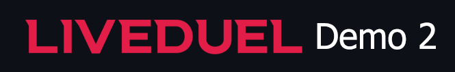

## ⚽ Overview
This demo project is a decentralized soccer prediction market platform built on the **Avalanche Fuji Testnet**. This monorepo contains all core components needed to operate the system, including smart contracts, a web frontend, a backend server, and a subgraph.

## 🛠 Technologies
- **Solidity** – Core logic for the prediction markets via smart contracts.
- **Chainlink Functions** – Acts as an Oracle for match result retrieval from API Football.
- **Chainlink Automation** – Executes smart contract actions (e.g., match resolution) automatically.
- **Gnosis Conditional Tokens Framework (CTF)** – Enables conditional payouts based on match outcomes.
- **Logarithmic Market Scoring Rule (LMSR)** – Dynamically calculates odds and manages liquidity.
- **The Graph Protocol** – Indexes on-chain events and provides efficient querying.
- **Next.js** + **RainbowKit** – Delivers a user-friendly web interface and WalletConnect integration.
- **Express.js** + **WebSockets** – Handles backend data aggregation and enables real-time odds updates.

---

## 🌍 Deployment
- **Contracts**: Deployed on **Avalanche Fuji Testnet**
- **Frontend**: Hosted on **Vercel**
- **Backend**: Hosted on **AWS EC2**
- **Subgraph**: Deployed using **The Graph's Hosted Service**
- **Live Demo**: [https://liveduel-demo-2.app/](https://liveduel-demo-2.app/)

---

## 📂 Directory Structure
```
├── contracts   # Solidity smart contracts 
├── frontend    # Next.js web interface
├── backend     # Express.js server aggregating data from The Graph & API Football 
└── subgraph    # The Graph Protocol subgraph for event indexing
```
Each module has its own **README.md** with setup and deployment instructions.

---

## 📝 Documentation
For module-specific setup instructions, refer to:
- [Contracts README](./contracts/README.md)
- [Frontend README](./frontend/README.md)
- [Backend README](./backend/README.md)
- [Subgraph README](./subgraph/README.md)

---

## 📄 License
This project is licensed under the [MIT License](LICENSE).

